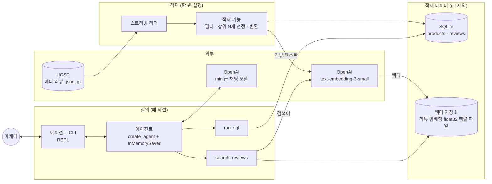
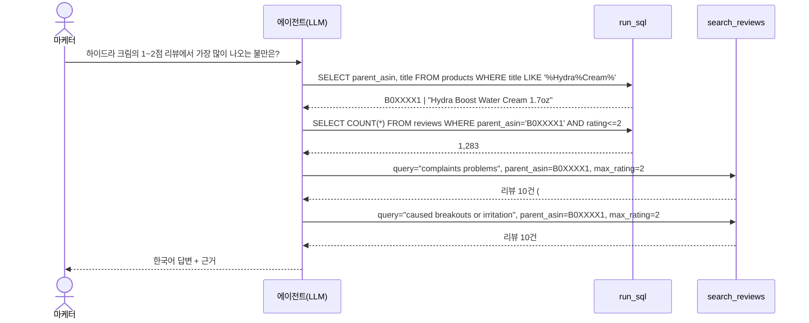

# 아키텍처 개요: 리뷰 질의 에이전트

적재와 질의가 맞물려 돌아가는 방식을 그림과 예시로 보여 주는 문서다. 결정의 원본은 스펙 이슈(#1 MVP · #9 평가 하네스 · #23 규모 확대와 병목 개선)와 `docs/adr/`이고, 이 문서는 그 결정들이 **지금** 어떤 모양으로 조립돼 있는지를 적는다. 용어는 `CONTEXT.md`를 따른다.

처음 온 사람은 `README.md`를 먼저 보는 편이 빠르다. 이 문서는 그다음이다.

## 한눈에 보기

시스템은 **적재**(가끔 한 번 실행)와 **질의**(마케터가 매번 쓰는 것) 두 흐름으로 나뉜다. 두 흐름은 **적재 데이터**(SQLite + 리뷰 벡터 저장소)를 통해서만 만난다.



## 구성요소

### 적재 흐름

| 구성요소 | 하는 일 | 만드는 티켓 |
|---|---|---|
| **스트리밍 리더** | UCSD의 메타·리뷰 `.gz`를 HTTP로 받으며 압축을 풀어 한 줄씩 넘긴다. 디스크에 원본을 저장하지 않는다. 적재 기능과 분리된 얇은 진입점이다. | #2 |
| **적재 기능** | 줄 스트림을 받아 적재 데이터를 만든다. (1) 메타에서 **적재 범위** 안의 상품을 고른다. (2) 리뷰 중 그 상품의 2023년 리뷰만 남긴다. (3) 2023년 리뷰 수 상위 N개 상품을 고른다. (4) SQLite에 쓴다. (5) 리뷰를 임베딩해 벡터 저장소 파일에 쓴다. 실행할 때마다 처음부터 다시 만든다. | #2 (SQLite), #4 (벡터 저장소), #25 (적재 범위) |

적재 기능은 URL이 아니라 **줄 스트림**, **`Embeddings` 객체**, **저장 위치**를 인자로 받는다. 그래서 테스트에서는 픽스처 줄, 가짜 임베딩, 임시 디렉터리를 넣어 네트워크 없이 돌릴 수 있다.

**적재 범위와 상위 N도 인자다**(`--scope`, `--top-n`). 적재 범위는 원본 카테고리 경로에서 루트(`Beauty & Personal Care`)를 뺀 접두사이고, 기본값은 얼굴 보습 제품(`Skin Care > Face > Creams & Moisturizers`)이다. 두 인자가 **규모 라벨**을 만들고, 그 라벨이 적재 데이터 디렉터리 이름과 평가 결과의 규모 필드가 된다. **기간은 인자가 아니다** — 2023년 리뷰만 담는 것은 상수다(스펙 #23).

### 적재 데이터

| 저장소 | 담는 것 | 누가 읽나 |
|---|---|---|
| **SQLite `products`** | 상품 한 행: `parent_asin`, 상품명, 평균 별점, 평점 수, 가격, 스토어, 카테고리, 특징, 상세 | `run_sql` |
| **SQLite `reviews`** | 리뷰 한 행: `review_id`, `parent_asin`, `asin`, 별점, 제목, 본문, `reviewed_at`, 도움돼요 수, 구매 인증 | `run_sql` |
| **리뷰 벡터 저장소** (`data/vectors.npz`) | 리뷰 임베딩을 L2 정규화한 float32 행렬 하나(`vectors`)와, 행마다 `review_id`(`ids`)·필터용 `parent_asin`·`rating`·`verified_purchase`. 검색과 필터에 필요한 것만 담고, 리뷰 제목·본문은 SQLite `reviews`에서 읽는다(ADR-0004). | `search_reviews` |

같은 리뷰가 SQLite와 벡터 저장소에 **같은 `review_id`** 로 들어 있다. 그래서 검색으로 찾은 리뷰를 SQL로 다시 조회하거나, 반대로 SQL로 찾은 리뷰를 인용할 수 있다.

### 질의 흐름

| 구성요소 | 하는 일 | 만드는 티켓 |
|---|---|---|
| **에이전트 CLI** | `.env`를 읽고, 에이전트를 만들고, 마케터의 입력을 받아 답변을 출력하는 REPL. 세션마다 `thread_id`를 하나 쓴다. | #3 |
| **에이전트** | LangChain `create_agent`로 만든 ReAct 에이전트. LLM이 도구를 부를지, 어떤 인자로 부를지, 언제 답할지를 판단한다. `InMemorySaver`가 세션 안의 대화를 기억한다. | #3 |
| **시스템 프롬프트** | 스키마 설명, 적재 범위, 한국어 답변, 근거 표시, 거절 규칙, 상품명으로 `parent_asin` 찾기, 브랜드는 `title`로 판단, 검색어는 영어로 넘기기 | #3, #4 |
| **`run_sql`** | 읽기 전용 SELECT를 실행하고 최대 50행을 돌려준다. 오류는 메시지로 돌려준다. | #2 |
| **`search_reviews`** | 검색어를 임베딩해 벡터 저장소에서 의미 검색을 하고, `parent_asin`·별점 범위·구매 인증 필터를 건다. 기본 10건을 돌려준다. | #4 |

## 동작 방식: end-to-end 예시

> 아래 **질의 예시**의 상품명, 수치, 리뷰 ID, 인용문은 설명을 위해 지어낸 값이다. 실제 측정값은 `evals/reports/`에 있다. 적재 예시는 실제 출력이다.

### 1. 적재 (개발자, 한 번)

```text
$ uv run load
완료: 상품 20개, 리뷰 4744건 · 규모 skin-care-face-creams-moisturizers-n20
```

범위를 넓히려면 인자를 준다. 규모마다 저장 위치를 따로 준다.

```text
$ uv run load --scope 'Skin Care > Face' --top-n all \
              --db data/scale/skin-care-face-all/reviews.db \
              --vectors data/scale/skin-care-face-all/vectors.npz
완료: 상품 16940개, 리뷰 107969건 · 규모 skin-care-face-all
```

내부에서 일어나는 일:
1. 스트리밍 리더가 메타 파일(gz 약 711MB)을 한 줄씩 넘긴다. 적재 기능은 `categories`가 **적재 범위** 아래인 상품만 모은다.
2. 스트리밍 리더가 리뷰 파일(gz 약 2.96GB)을 한 줄씩 넘긴다. 적재 기능은 1에서 모은 상품의 2023년 리뷰만 남기고 상품별로 센다.
3. 2023년 리뷰가 가장 많은 상위 N개 상품을 고른다(`all`이면 전량). 메타가 없는 리뷰는 버린다.
4. SQLite에 고른 상품과 그 `reviews` 전부를 쓴다. 이때 `review_id`를 부여하고 `timestamp`를 `reviewed_at`으로 바꾼다.
5. 같은 리뷰를 임베딩해 벡터 저장소 파일에 쓴다.

### 2. 질의 (마케터, 매 세션)

**질문 1: 조회와 검색을 섞는 질문 (MVP 완료 기준 3번)**

```text
$ uv run agent
> 하이드라 크림의 1~2점 리뷰에서 가장 많이 나오는 불만은?
```

에이전트 내부의 ReAct 루프:



1. **상품 찾기**: 마케터는 상품명만 말했다. 에이전트는 `run_sql`로 `products.title`을 검색해 `parent_asin`을 알아낸다.
2. **규모 확인**: `run_sql`로 1~2점 리뷰가 몇 건인지 센다.
3. **의미 검색**: `search_reviews`에 영어 검색어와 필터(`parent_asin`, `max_rating=2`)를 넘긴다.
4. **다시 판단**: 결과에 트러블 이야기가 많자, 그 주제로 한 번 더 검색해 빈도를 확인한다. 몇 번 더 부를지는 LLM이 판단한다.
5. **답변**: 모은 내용을 한국어로 요약하고 근거를 붙인다.

```text
하이드라 부스트 워터 크림(B0XXXX1)의 1~2점 리뷰는 1,283건입니다.
검색한 리뷰에서 반복되는 불만은 다음과 같습니다.

1. 트러블·자극: 바른 뒤 뾰루지나 따가움이 생겼다는 내용이 가장 많습니다.
   - #40211: "broke me out within two days"
   - #40932: "burning sensation on my cheeks"
2. 끈적임: 흡수가 느리고 끈적인다는 불만입니다.
   - #40587: "stays sticky for hours"
3. 용기·용량: ...

근거:
- SQL: SELECT COUNT(*) FROM reviews WHERE parent_asin='B0XXXX1' AND rating<=2 → 1283
- 인용한 리뷰는 의미 검색으로 찾은 20건 중 일부입니다. 불만의 순서는 검색 결과에서 본 빈도이고, 1,283건 전체를 센 값이 아닙니다.
```

**질문 2: 후속 질문 (MVP 완료 기준 4번)**

```text
> 그럼 5점 리뷰에서는 뭘 칭찬해?
```

`InMemorySaver`가 이전 대화를 기억하므로, 에이전트는 "그럼"이 같은 상품(B0XXXX1)을 가리킨다고 판단한다. 그래서 상품 찾기를 건너뛰고 곧바로 `search_reviews(query="what users love", parent_asin=B0XXXX1, min_rating=5)`를 호출한다.

**질문 3: 답할 수 없는 질문 (MVP 완료 기준 5번)**

```text
> 이 상품의 한국 매출은?
적재 데이터로는 답할 수 없습니다. 적재된 데이터는 미국 Amazon의 상품 정보와 리뷰뿐이고,
매출이나 국가별 판매 정보는 없습니다. 대신 리뷰 수와 평점 수는 알려 드릴 수 있습니다.
```

에이전트는 시스템 프롬프트의 스키마 설명을 보고 매출 컬럼이 없다는 것을 안다. 도구를 부르지 않거나, 불러서 확인한 뒤 거절한다.

## 평가 하네스가 붙는 자리

**평가 하네스는 위 그림에 나오지 않는다.** 운영 경로에 계측 코드를 심지 않기로 했기 때문이다(스펙 #9). 대신 바깥에서 두 군데만 붙잡는다.

| 붙는 곳 | 어떻게 |
|---|---|
| 임베딩 | 하네스가 `Embeddings` 객체를 **계측 래퍼로 감싸 주입**한다. 그래서 임베딩 API 왕복 시간과 호출 수가 따로 잡힌다 |
| 벡터 저장소 열기 | 하네스가 저장소 여는 호출을 감싸 잰다. 세션당 한 번뿐인 비용이라 질문당 시간과 섞지 않는다. 잴 때 페이지 캐시를 버려 **항상 콜드로** 잰다 |

LLM 턴과 도구 호출의 경계는 LangChain 콜백으로 잡고, 궤적은 결과 메시지의 `tool_calls`에서, 토큰은 `AIMessage`의 사용량 메타데이터에서 읽는다. **하네스는 저장소 종류를 모른다.**

쓰는 법과 결과 읽는 법은 `README.md` 6절, 직접 만든 이유는 ADR-0003에 있다.

## 경계

- **에이전트가 아는 것은 도구 이름과 입출력뿐이다.** 저장소를 바꿀 때 영향받는 범위는 세 곳이다.
  - 적재 기능
  - 두 도구의 구현
  - 시스템 프롬프트의 스키마 설명(SQL 방언이 바뀌는 경우)

  **이 경계는 실제로 시험됐다.** 리뷰 벡터 저장 형식을 들여쓰기 JSON에서 float32 행렬로 바꿀 때(ADR-0004) 고친 곳은 적재 기능과 `search_reviews`뿐이었다. 평가 하네스도, 케이스 파일도, `run_sql`도 그대로였다.

- **자동 테스트 경계는 "적재한 뒤 두 도구로 조회"** 이다(스펙 #1 Testing Decisions). 픽스처 줄·가짜 임베딩·임시 디렉터리를 넣어 네트워크 없이 돈다. 에이전트·시스템 프롬프트·CLI처럼 LLM 출력이 매번 달라지는 부분은 이 경계 밖이고, **평가 하네스가 맡는다.**

- **지금도 없는 것**: 웹 UI, HTTP API, 여러 마케터·동시 사용·인증, 세션 간 대화 저장, 질문 유형별 전용 도구, 근사 최근접(ANN) 검색.

  마지막 것은 후보로 검토했다가 뺀 것이다. 의미 검색은 여전히 **전수 비교**이고, 그래서 저장 형식을 바꿔도 검색 결과가 사실상 그대로였다. 근사 검색으로 옮기면 검색 정확도가 바뀌므로 recall@k 평가가 같이 따라와야 한다(스펙 #23).

- **규모의 한계**는 `(아키텍처, 기계)` 쌍으로만 말한다. 측정값과 그 해석은 `evals/reports/scale-curve-float32-matrix-vs-in-memory-vector-store.md`에 있다.
